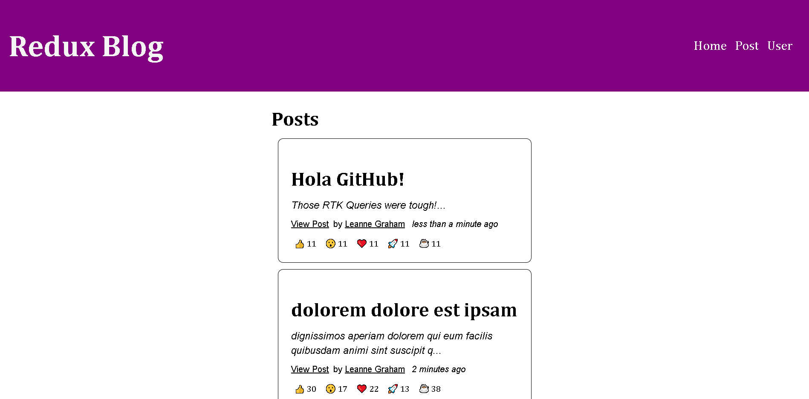

# Redux Toolkit (Blog-App with advanced RTK Queries from the Redux Toolkit)

 This is a Blog-App built with React and Redux but with way harder optimizations and advanced skills like optimistic updates, normalization, RTK queries, memoization and more!

> RTK Query is an advanced data fetching and caching tool, designed to simplify common cases for loading data in a web application. RTK Query itself is built on top of the Redux Toolkit core, and leverages RTK's APIs like createSlice and createAsyncThunk to implement its capabilities.
  

## Built With

- React
- Redux
- CSS
- Linters
- Yarn
- JSON-Server

## Live Demo

N/A

## Getting Started

To get a local copy up and running follow these simple example steps.

### Prerequisites

- Laptop or Desktop
- Web Browser
- Node.js (installed and set up)
- IDE (preferably Visual Studio Code)
- Programming Knowledge

### Setup

- Clone this [repo](https://github.com/SaidRasinlic/Redux-Toolkit)
- Navigate to the correct directory `cd redux-toolkit` (case sensitive)
- In your terminal run the following commands:
  - `yarn install`
- Run `yarn start` to start your server and build the required configuration
- Run `json-server --watch data/db.json --port 3500` to start your JSON server and build the required configuration (if you don't have installed json-server please install it globally by running `npm install -g json-server` in your terminal)
- Enter `http://localhost:3000/` or `localhost:3000` in your browser to run the app locally

## Authors

👤 **Said Rasinlic**

- GitHub: [@GitHub/SaidRasinlic](https://github.com/SaidRasinlic)
- Twitter: [@Twitter/SaidRasinlic](https://twitter.com/SaidRasinlic)
- LinkedIn: [LinkedIn/SaidRasinlic](https://www.linkedin.com/in/saidrasinlic)

## 🤝 Contributing

Contributions, issues, and feature requests are welcome!

Feel free to check the [issues page](../../issues/).

## Show your support

Give a ⭐️ if you like this project!

## Acknowledgments

- Dave Gray

## 📝 License

This project is [MIT](LICENSE) licensed.
